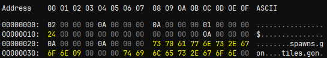
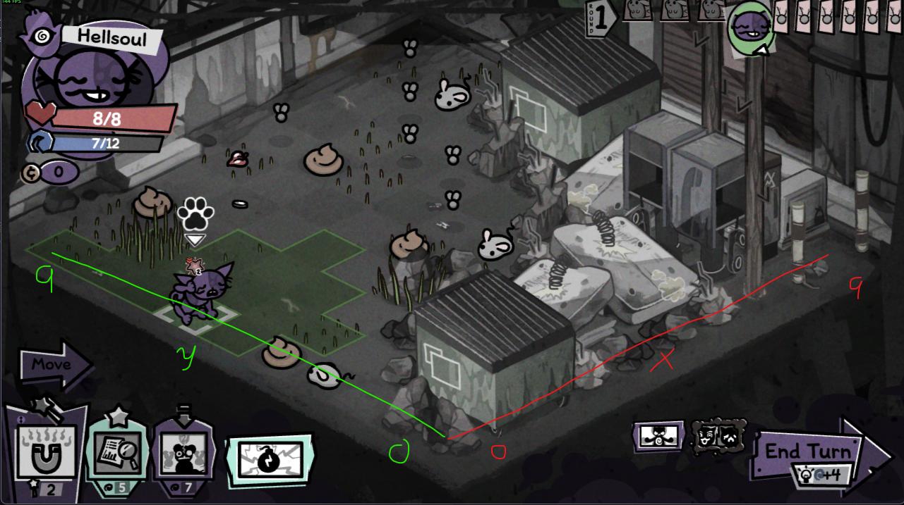
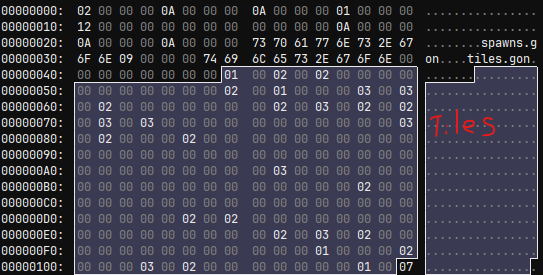
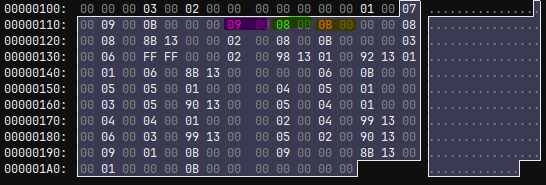
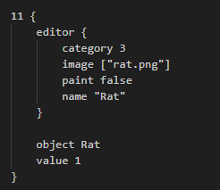
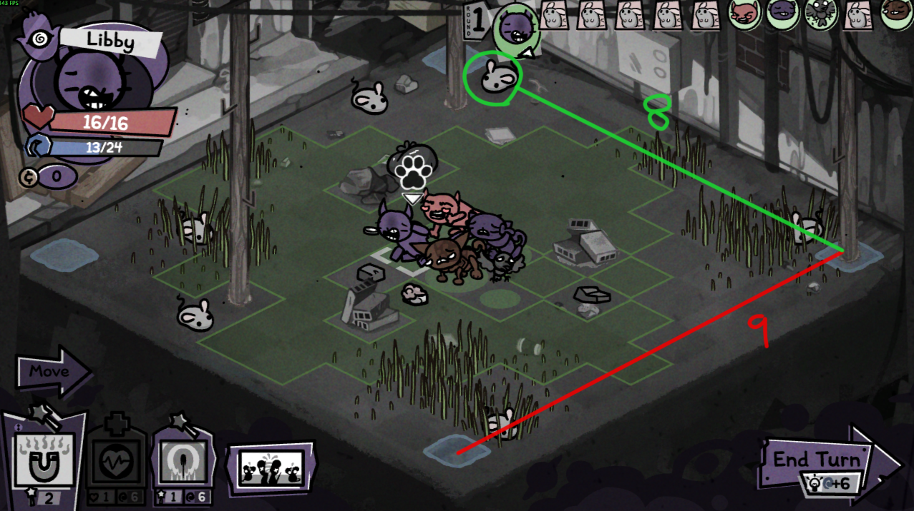
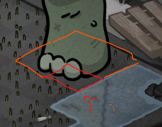
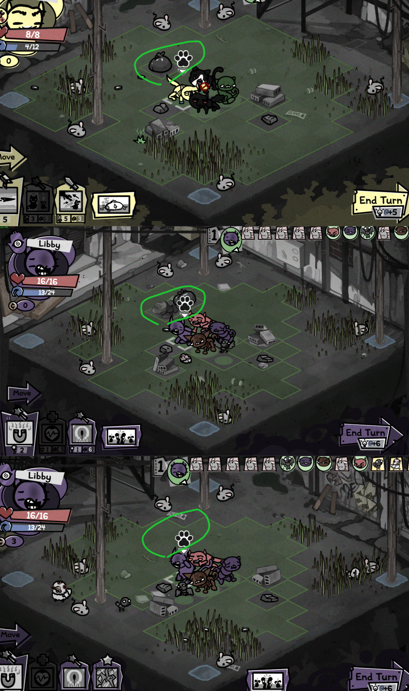
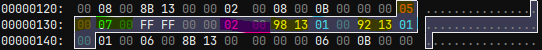

# Mewgenics Level Editor
This is a fan made open source program in order to create levels for the Mewgencis .lvl files.

The project is still currently in the works and not nearly in a working state.

If you want to make your own levels while I'm working on the program I'll show you how the .lvl files are formatted below.

In order to read the .lvl files binary data I've been using ImHex but you can use basically any hex Editor

## .lvl structure

### Header

Here's an example I pulled from ch1-17.lvl

The first few bytes of the .lvl files are always the same spare for one number.
the byte at position 0x10 lists the number of entities from spawns.gon so it knows where the end of the file is
if you get this number wrong you will get an out of range error when loading the level in-game.

In this case its 0x24 which is 36.

### Level Axis

The axis of the grid is a little counter-intuitive.

This is more important when we get to level entities, but it's important to know that the list of 100 ground tiles iterates over x first.
So when making the level you need to view the bytes flipped from their in-game state.

### Level Tiles

The next part of the file is the actual level tiles themselves.
Here's a test level I was messing with based on ch1-6

The levels in Mewgeneics are 10x10 which means that each level contains 100 tiles.

Starting at 0x47 and ending at 0x10E (100 words) we have the tiles listed in big endian.

I marked every corner of the level with a water tile (01).

When looking at this section you can build the level in your head (kind of)
01: water
02: grass
03: tall grass (though there seems to be some randomness here)

### Level Entities

This section is a little more complicated

The area I've highlighted is one entity:
You read it like this

(x, y, Entitiy ID, flag)

the entity id's are found in spawns.gon

We have (9, 8)

The entity we are looking for in decimal is entity 11

Here we see it's a rat

If we look at our map in-game here:

at position 9, 8. There's out rat!

(I have no idea what the flag does quite yet)

### Multi-tile Entities

When spawning entities that take up more than one tile the game uses the position with the smallest x,y
In my head I think it's the top right, but I rotate the map around in my head now.

### Random Spawns

Welcome to the complicated section.

There are still some aspects of the random spawns that I don't understand, but I'll give you what I know.

Take a look at the tiles I've highlighted here.

In the .lvl file that coordinate looks like this:

notice the only thing that changes in the level is the position associated with FFFF

The format of this series goes 
(X, Y, FFFF (Declare Random), flag, Number of entities (Maybe), Entity, Entity Weight, Entity, Entity Weight)

The entity numbers associated with this random flag are:

5016 (Static 1x1 A (Rubble))
and
5010 (Trash Bag)

That's exactly what we see.

### What I don't know

When you look in the previous image you'll notice that the random items spawn on two tiles rather than just the one specified.
I need to do more testing to figure out what is causing this, but it seems to be tied to being on position x position 4, or 5.

### End

That's everything I know for right now.

I've provided a zip file mod including the things you need to get the level to load on the standard levelset in the alley.
Replace the dino level with whatever you want. The dino is nice because it's very obvious when it's working.